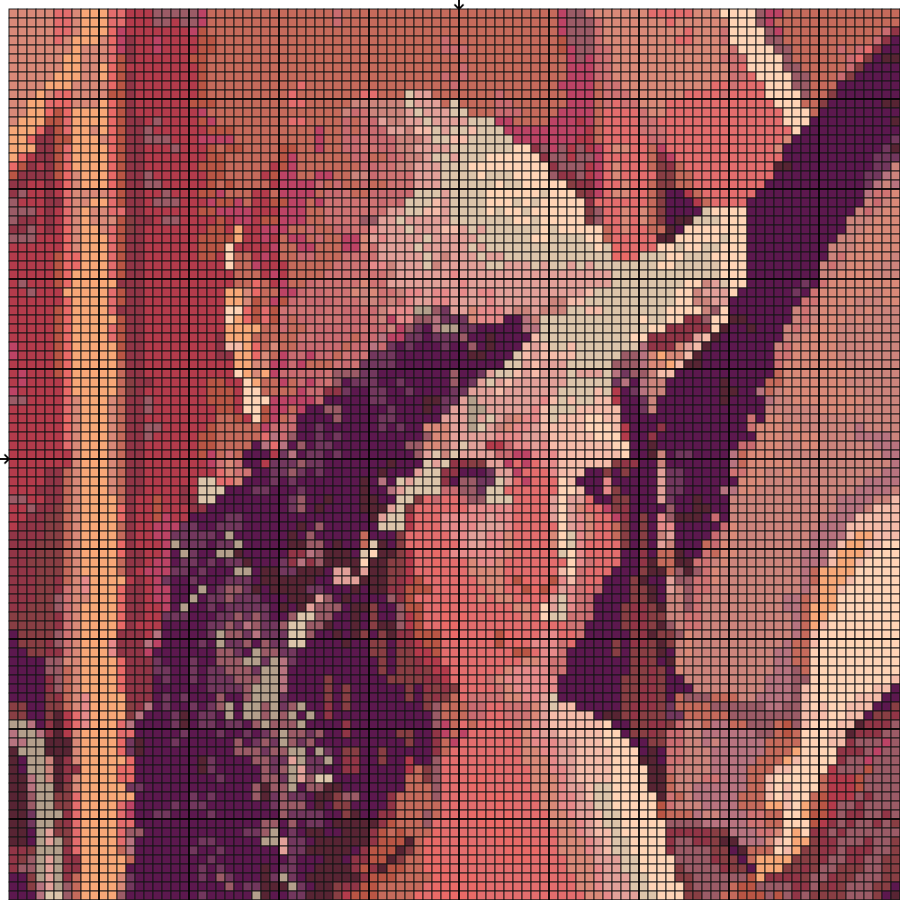
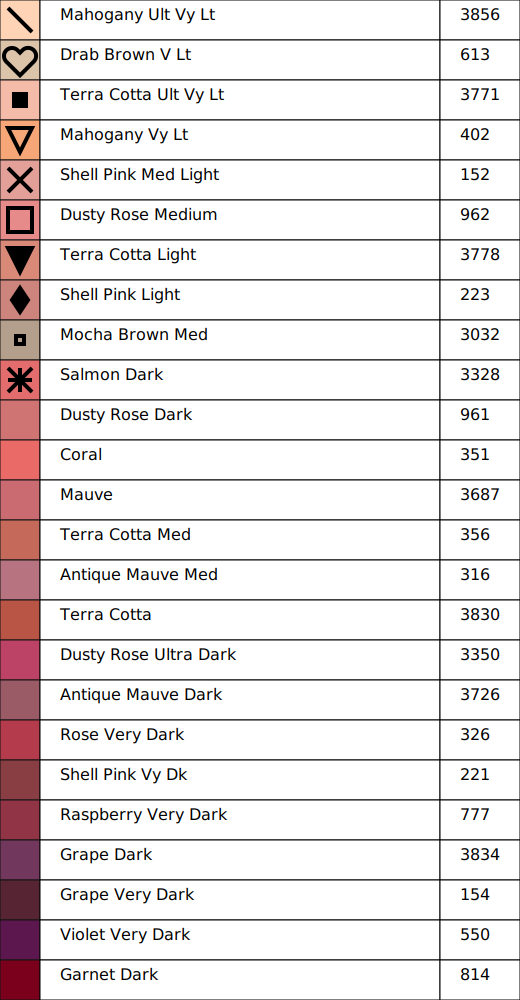

# Cross_Stitch
Приложение, создающее паттерн для вышивания крестиком

На данный момент реализовано:
1) Предварительная обработка изображения;
2) Подбор цвета из палитры производителя мулине;
3) Разбиение изображения на блоки;
4) Постобработка полученного паттерна;
5) Генерация ключа для вышивки;

### Пример работы:
#### Оригинал:

#### Цветной паттерн без символов:

#### Цветной паттерн с символами:

#### Ключ для полученного паттерна:

#### Черно-белый паттерн с символами:
